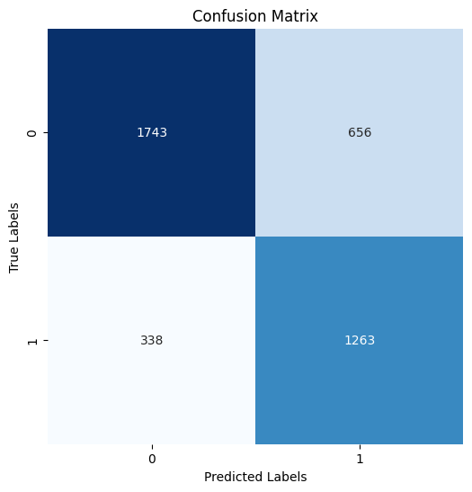

# Introduction
* This code is for clover health technical interview, working on medical data analysis and predictions.

# Procedure

## Data Exploration and Preprocessing
* **Datasets:** The project uses two datasets
  * `meps_meds.csv` (medications history of clients)
  * `meps_base_data.csv` (background information of clients)
* **Handling Duplicates and Malformed Records**
  * The datasets contain some duplicates and malformed records, including nonsensical values in certain columns
  * Since the datasets are large, I dropped these records, as removing a small portion of the data was acceptable
  * However, for smaller datasets, alternative techniques like imputation could be preferable to retain data
* **Target Selection**
  * After cleaning the data, I selected `highBPDiagnosed` as the target disease to predict
* **Dimensionality Reduction**
  * The medication history dataset has nearly 7,000 features, which is very huge and inefficient to process directly
  * With the computing power and time constraints, a more efficient way is required to reduce dimensions
  * **First Layer of Reduction:** I performed correlation analysis with the target variable `highBPDiagnosed` and selected the N most correlated features as a first filter
  * **Second Layer of Reduction:** Using Recursive Feature Elimination (RFE), I further reduced the dimensionality to R features by eliminating less relevant variables at each step
    * I experimented with different combinations of (N, R): (50, 20), (200, 100), (1000, 500), (2000, 1000)
    * Ultimately I selected (200, 100) based on computational efficiency and model performance.
      * i.e. the more features I added did not improve the performance much
* **Dataset Merging**
  * After reducing the medication history dataset, I merged it with the client background dataset
  * To maintain consistency, clients not present in the `highBPDiagnosed` target column were removed
* Detailed analysis and code explanations are documented in `notebook/meps-eda.ipynb`

## Training
* Data module is designed for CSV input file in `src/datamodule.py`
  * I added a SMOTE (Synthetic Minority Oversampling Technique) flag to handle a seriously imbalanced data with Oversampling
  * It did not show improvements on my current dataset during experiment since the class of `highBPDiagnosed` is not hugely imbalanced (the ratio is about 3:2), so I just leave this flag `False` as default
* A binary classifier model is implemented in `src/models/classifier.py`
  * It is a simple MLP with a sigmoid node at the end, which is suitable for binary classification
* I used PyTorch Lightning to build a trainer that can train the model with more flexibility
  * Detail training implementation can be found in `src/models/classification_model.py`
* Few more components I added
  * WandB Logger 
  * WandB hyperparameter tuning Sweep (Bayesian Optimization)
  * Early stopping
* With this setting, we can monitor all the metrics on WandB

* Data Module
  * Implemented a data module in `src/datamodule.py` to handle CSV input files. 
  * SMOTE Flag: I added a SMOTE (Synthetic Minority Oversampling Technique) option for handling imbalanced datasets through oversampling. 
  * Since the `highBPDiagnosed` class ratio is around 3:2, SMOTE did not significantly improve model performance, so I left this flag set to False by default. 
* Model
  * Developed a binary classifier in `src/models/classifier.py` using a simple MLP architecture with a sigmoid activation for binary classification
* Training Setup
  * I used PyTorch Lightning to structure the training and make the model training process more modular and manageable
  * Details are implemented in `src/models/classification_model.py`
* Additional Components
  * WandB Logger: For experiment tracking and visualization 
  * WandB Hyperparameter Sweep: Implemented Bayesian Optimization with WandB Sweeps to tune hyperparameters 
  * Early Stopping: Prevent overfitting and save resources  
* This setup allows real-time monitoring of metrics and hyperparameter configurations on the WandB dashboard

## Evaluation
* Since this is a medical-related problem, it is crucial to minimize False Negatives to avoid missing potential cases, which could delay necessary intervention.
* For this reason, I emphasized recall in this evaluation
* Here the metrics I value most in the training
  * Confusion Matrix: Still important, providing an exact breakdown of correct and incorrect predictions
  * Recall: Prioritized metric, indicating the model’s ability to identify all relevant cases
  * F1-score: General performance metric, balancing precision and recall

## Results
* Training metrics
  * 'train/loss': 1.130,
  * train/acc=0.778,
  * train/precision=0.667,
  * train/recall=0.667,
  * train/f1=0.667,
* Validation metrics
  * val/loss=1.140,
  * val/acc=0.746,
  * val/precision=0.652,
  * val/recall=0.795,
  * val/f1=0.707
* Testing metrics
  * 'test/loss': 1.1435887813568115,
  * 'test/acc': 0.7367500066757202,
  * 'test/precision': 0.6344128251075745,
  * **'test/recall': 0.8211082220077515,**
  * **'test/f1': 0.7075808644294739**
* 

## Interpretation of Results
* **Training and Validation**
  * Training Accuracy (0.778) and Validation Accuracy (0.746) are relatively close, indicating that the model isn’t overfitting
  * However, both are not particularly high, which suggests some degree of underfitting.
  * Similarly, Training and Validation Loss are also close (1.130 vs. 1.140), which supports the idea of underfitting rather than overfitting.
  * F1 Scores in Training (0.667) and Validation (0.707) suggest the model is performing moderately on balancing precision and recall, but may not yet be optimized.
* **Testing**
  * Testing Accuracy is close to validation accuracy (0.736 vs. 0.746), which confirms the model generalizes reasonably well to unseen data. 
  * The F1 score on the test set is 0.707, aligning with the validation F1 score, suggesting consistent performance. 
  * Recall is the _highest metric_ among the test metrics (0.821), which aligns well with the objective to minimize false negatives. 
    * This indicates the model is good at identifying true positives, which is important for our medical applications. 
  * However, Precision is relatively lower (0.634), meaning the model has a moderate rate of false positives. 
  * While recall is prioritized, improving precision would also help ensure resources are not wasted on false alarms.
* **Further Improvement**
  * Increase Model Complexity
    * Given the relatively large dataset, the model could benefit from increased complexity. 
    * I am currently using a simple MLP architecture, but moving to a more complex model, CNN layers for example, could capture more complex patterns and lead to higher accuracy.
  * Experiment with Feature Engineering
    * As mentioned in EDA section, I cannot explore feature interactions due to time constraints. 
    * I believe the dataset with feature interactions could further enhance model performance.
    * Dimensionality reduction techniques, such as PCA or Lasso-based feature selection, could be further experimented to improve the dataset for modeling.
  * Hyperparameter Tuning
    * I set up a robust search system for hyperparameter tuning, which we can utilize more extensively once we move to a more complex model. 
    * Running searches will help us identify the most effective configurations for optimizing model performance.

## How to Run?
### Run Locally
Install dependencies
```yaml
# [OPTIONAL] create conda environment
conda create --name clover-py312 python=3.12
conda activate clover-py312

# install requirements
pip install -r requirements.txt
```

Train model with default configuration
```yaml
# default
python main.py

# train on CPU
python main.py trainer_gpus=0

# train on GPU
python main.py trainer_gpus=1
```

You can override any parameter from command line like this
```yaml
python main.py --trainer_max_epochs=20 --datamodule_batch_size=32
```

### Run with Docker
Build docker image
```yaml
# For amd64 (Intel/AMD)
docker buildx build --platform linux/amd64 -t dantelok/clover-health-amd64:latest --load .

# For arm64 (M1 Mac)
docker buildx build --platform linux/arm64 -t dantelok/clover-health-arm64:latest --load .
```

Run image
```yaml
# For amd64 (Intel/AMD)
docker run -it --rm dantelok/clover-health-amd64:latest

# For arm64 (M1 Mac)
docker run -it --rm dantelok/clover-health-arm64:latest
```

Similarly, you can override any parameter from command line like this
```yaml
# For amd64 (Intel/AMD)
 docker run -it --rm dantelok/clover-health-amd64:latest --trainer_max_epochs 20 --datamodule_batch_size 32

# For arm64 (M1 Mac)
 docker run -it --rm dantelok/clover-health-arm64:latest --trainer_max_epochs 20 --datamodule_batch_size 32
```

